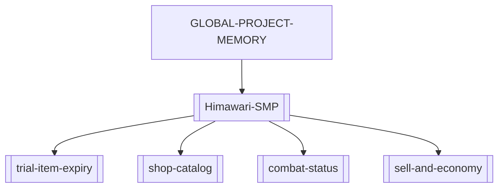

# GLOBAL PROJECT MEMORY

Global source of truth and index for the SecondaryBrain. Everyday loop: read this → read the
matching project cluster → reuse documented patterns → update after meaningful changes. Full
"deep mode" ceremony lives in `_System/reference-architecture-protocol.md`.

## Project clusters

### Himawari SMP
Fabric Minecraft server mod (`com.survivalmod` / `survivalmod`). MC 26.2, Java 25, Fabric Loom.
Built from WSL; `deployToMods` auto-copies the jar to the live server
(`D:\Minecraft Server\HimawariSMP_1\mods`). Hub: [[Himawari-SMP]].
Nodes: [[trial-item-expiry]], [[shop-catalog]], [[combat-status]], [[sell-and-economy]].

## Dependency graph

## Evolution timeline
- **2026-06-20** — SecondaryBrain bootstrapped. Himawari SMP cluster created. Trial tools now
  destroy the whole item on expiry (inventory, ender chest, loaded world containers, nested
  shulkers/bundles), not just disabling the effect. Built & deployed as `survivalmod-1.0.14.jar`.
- **2026-06-21** — Batch update, built & deployed as `survivalmod-1.0.16.jar`:
  - [[sell-and-economy]] — `/sell` now sells the held stack; new `/sellall` sells all of the held
    type; whole-inventory sell removed.
  - [[combat-status]] — replaced the action-bar combat line with a draining red boss bar; combat now
    also gates **auto-accept TPA**; teleport accept plays a chime.
  - [[trial-item-expiry]] — fixed expired tools surviving in chests within loaded non-ticking chunks
    (`getChunkNow` instead of `getTickingChunk`); ender-chest countdown lore.
  - [[shop-catalog]] — five new survival buy/sell tabs backed by a new Supabase `shop_catalog` table
    (339 rows seeded via the Supabase MCP, project `tdmzxxyctqnxxkdulvar`).
  - Earlier 1.0.15 work was never deployed; this is the first bundle carrying all of the above.

## Deprecated nodes
_(none yet)_
