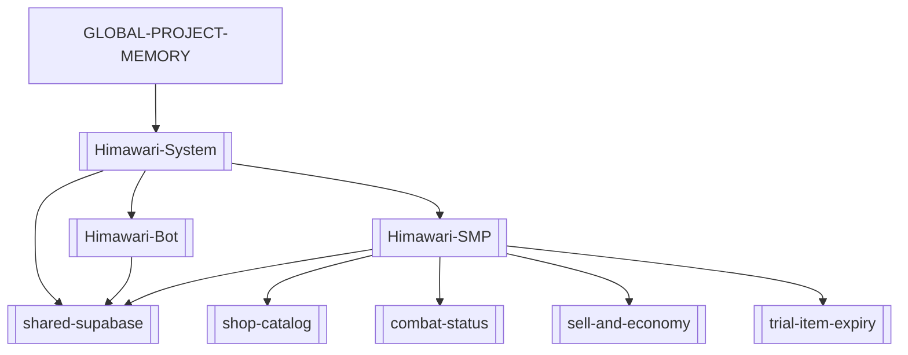

# GLOBAL PROJECT MEMORY

Global source of truth and index for the SecondaryBrain. Everyday loop: read this → read the
matching project cluster → reuse documented patterns → update after meaningful changes. Full
"deep mode" ceremony lives in `_System/reference-architecture-protocol.md`.

## Project clusters

### Himawari (Bot + Mod + shared DB)
The WopsSMP system: one repo, **two projects** joined by **one shared Supabase project** ("Mod",
`tdmzxxyctqnxxkdulvar`). Top hub: [[Himawari-System]].
- [[Himawari-Bot]] — Discord bot (Node.js / discord.js 14), deploys to Discloud.
- [[Himawari-SMP]] — Fabric Minecraft mod (`com.survivalmod`, MC 26.2, Java 25); built from WSL,
  `deployToMods` auto-copies the jar to `D:\Minecraft Server\HimawariSMP_1\mods`.
- [[shared-supabase]] — the bridge: linking, mod live-config, backups, bot ticket/embed tables.
Feature nodes: [[shop-catalog]], [[combat-status]], [[sell-and-economy]], [[trial-item-expiry]],
[[auction-marketplace]].

## Dependency graph

## Evolution timeline
- **2026-06-20** — SecondaryBrain bootstrapped. Himawari SMP cluster created. Trial tools now
  destroy the whole item on expiry (inventory, ender chest, loaded world containers, nested
  shulkers/bundles), not just disabling the effect. Built & deployed as `survivalmod-1.0.14.jar`.
- **2026-06-21** — Batch update, built & deployed as `survivalmod-1.0.16.jar`:
  - [[sell-and-economy]] — `/sell` now sells the held stack; new `/sellall` sells all of the held
    type; whole-inventory sell removed.
  - [[combat-status]] — replaced the action-bar combat line with a draining red boss bar; combat now
    also gates **auto-accept TPA**; teleport accept plays a chime.
  - [[trial-item-expiry]] — fixed expired tools surviving in chests within loaded non-ticking chunks
    (`getChunkNow` instead of `getTickingChunk`); ender-chest countdown lore.
  - [[shop-catalog]] — five new survival buy/sell tabs backed by a new Supabase `shop_catalog` table
    (339 rows seeded via the Supabase MCP, project `tdmzxxyctqnxxkdulvar`).
  - Earlier 1.0.15 work was never deployed; this is the first bundle carrying all of the above.
  - Shop catalog extended with concrete-powder (×16), `powder_snow_bucket`, and the netherite raws
    (ancient_debris/scrap/ingot/block) in Resources — 360 `shop_catalog` rows total.
- **2026-06-21** — Documented the **whole system architecture** in the vault: added [[Himawari-System]]
  (top hub), [[Himawari-Bot]] (Discord side), and [[shared-supabase]] (the shared DB + linking flow);
  expanded [[Himawari-SMP]] into a full 29-package subsystem map. The cluster now spans bot + mod +
  shared DB, not just the mod.
- **2026-06-21** — Auction house got a GUI **Create Listing** wizard (item-from-inventory → amount →
  price-each → review), mirroring the buy-order wizard. New node [[auction-marketplace]]. Built &
  deployed as `survivalmod-1.0.17.jar`.

## Deprecated nodes
_(none yet)_
