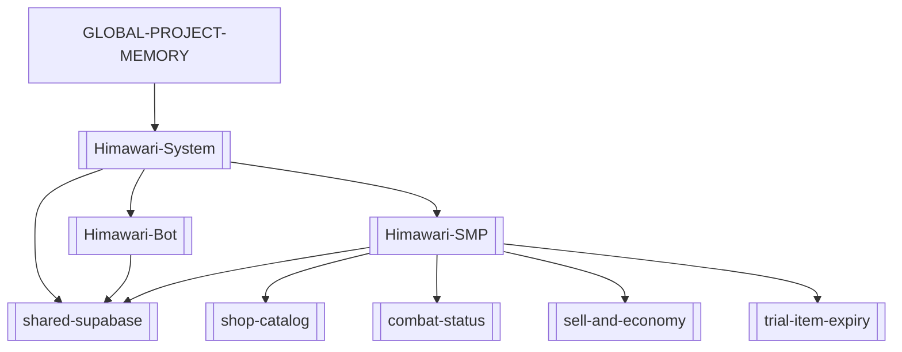

# GLOBAL PROJECT MEMORY

Global source of truth and index for the SecondaryBrain. Everyday loop: read this → read the
matching project cluster → reuse documented patterns → update after meaningful changes. Full
"deep mode" ceremony lives in `_System/reference-architecture-protocol.md`.

## Project clusters

### Himawari (Bot + Mod + shared DB)
The WopsSMP system: one repo, **two projects** joined by **one shared Supabase project** ("Mod",
`tdmzxxyctqnxxkdulvar`). Top hub: [[Himawari-System]].
- [[Himawari-Bot]] — Discord bot (Node.js / discord.js 14), deploys to Discloud.
- [[Himawari-SMP]] — Fabric Minecraft mod (`com.survivalmod`, MC 26.2, Java 25); built from WSL,
  `deployToMods` auto-copies the jar to `D:\Minecraft Server\HimawariSMP_1\mods`.
- [[shared-supabase]] — the bridge: linking, mod live-config, backups, bot ticket/embed tables.
Feature nodes: [[shop-catalog]], [[combat-status]], [[sell-and-economy]], [[trial-item-expiry]],
[[auction-marketplace]], [[moderation-bans]], [[admin-investigator]], [[bounties]], [[audit-log]].

### NewBaritone (Baritone pathfinding client mod)
Standalone Fabric **MC 26.2 / Java 25** client mod — fork of cabaletta/baritone. Top node:
[[NewBaritone]]. Built from WSL (same toolchain pattern as [[Himawari-SMP]]: LF gradlew, WSL-only
builds, `deployToMods` → `.minecraft/mods`). MC 26.x is unobfuscated, so no mappings/remap.

## Dependency graph

## Evolution timeline
- **2026-06-20** — SecondaryBrain bootstrapped. Himawari SMP cluster created. Trial tools now
  destroy the whole item on expiry (inventory, ender chest, loaded world containers, nested
  shulkers/bundles), not just disabling the effect. Built & deployed as `survivalmod-1.0.14.jar`.
- **2026-06-21** — Batch update, built & deployed as `survivalmod-1.0.16.jar`:
  - [[sell-and-economy]] — `/sell` now sells the held stack; new `/sellall` sells all of the held
    type; whole-inventory sell removed.
  - [[combat-status]] — replaced the action-bar combat line with a draining red boss bar; combat now
    also gates **auto-accept TPA**; teleport accept plays a chime.
  - [[trial-item-expiry]] — fixed expired tools surviving in chests within loaded non-ticking chunks
    (`getChunkNow` instead of `getTickingChunk`); ender-chest countdown lore.
  - [[shop-catalog]] — five new survival buy/sell tabs backed by a new Supabase `shop_catalog` table
    (339 rows seeded via the Supabase MCP, project `tdmzxxyctqnxxkdulvar`).
  - Earlier 1.0.15 work was never deployed; this is the first bundle carrying all of the above.
  - Shop catalog extended with concrete-powder (×16), `powder_snow_bucket`, and the netherite raws
    (ancient_debris/scrap/ingot/block) in Resources — 360 `shop_catalog` rows total.
- **2026-06-21** — Documented the **whole system architecture** in the vault: added [[Himawari-System]]
  (top hub), [[Himawari-Bot]] (Discord side), and [[shared-supabase]] (the shared DB + linking flow);
  expanded [[Himawari-SMP]] into a full 29-package subsystem map. The cluster now spans bot + mod +
  shared DB, not just the mod.
- **2026-06-21** — Auction house got a GUI **Create Listing** wizard (item-from-inventory → amount →
  price-each → review), mirroring the buy-order wizard. New node [[auction-marketplace]]. Built &
  deployed as `survivalmod-1.0.17.jar`.
- **2026-06-22** — Staff & economy batch (`survivalmod-1.0.18.jar`): cash amounts accept k/m/b/t
  (`/pay`,`/cash`,`/bounty`); ranks collapsed to **owner + mod**, owner commands work without OP
  (`isOwnerSource`), `/revenue` owner-only; new **/admin investigator** book + board
  ([[admin-investigator]]); **ban/mute** mod-enforced + Supabase ([[moderation-bans]]); **bounties**
  with PvP-kill payout + heads GUI ([[bounties]]). New Supabase tables `banned_players`,
  `muted_players`, `investigations`.
- **2026-06-22** — Staff-tool hardening + audit (`survivalmod-1.0.19.jar`): `/cash` reverted to
  owner-**with-OP**; Investigator (and new owner-only **/log**) books are **destroyed on drop** and
  **rank-gated on use** (so a stolen tool is useless); a **command audit log** records every mod/owner
  command (mixin on `Commands.performPrefixedCommand`), reviewed via the /log book → staff heads →
  recent commands. New node [[audit-log]].
  - ⚠️ Deploy/drive note: the live server folder name flaps between `HimawariSMP_1` and `HimawariSMP`
    (same folder, renamed; WSL `/mnt/d` also goes stale). It is `HimawariSMP_1` again now; `modsDir`
    reverted to `/mnt/d/Minecraft Server/HimawariSMP_1/mods` and 1.0.19 copied there from Windows.
    Confirm the live `mods` folder before each deploy.
- **2026-06-22** — "Trial toggle not working" turned out to be **not a bug**: the Fortune↔Silk right-click
  toggle is suppressed whenever the player holds **food (any consumable) in the off-hand** (the
  `eatingOffhand` guard lets you eat instead). Found via temporary `[trial-diag]` logging on
  `survivalmod-1.0.20.jar`; the toggle code was correct. Documented the toggle + the off-hand-food gotcha
  in [[trial-item-expiry]]. Also noted: the live `mods` folder has **duplicate `fabric-api` jars**
  (0.152.1 + 0.152.2) and some client-only mods.

- **2026-06-23** — New project [[NewBaritone]] added to the vault. Ported the Baritone client mod from
  MC 26.1 → **26.2** and got it building + deployed as `baritone-1.17.0.jar` into
  `.minecraft/mods` (client-only). Fixed the harness (build from WSL only; LF `gradlew`) and the
  26.1→26.2 API deltas: `Tuple` removed (drop-in `baritone.api.utils.Tuple`), shulker/bed colour
  collections (`ColorCollection.asList()`), `Gui.getChat()`→`chatListener().handleSystemMessage`,
  toast via `gui.toastManager()`, current screen on `Gui.screen()` + `setScreenAndShow`,
  `BlockPos.getCenter()`→`Vec3.atCenterOf`, `LevelRenderer.resetLevelRenderData()`,
  `EntityType.X`→`EntityTypes.X`, and a `require=0` on the now-unmatched `MixinMinecraft` screen
  redirect. **The path-render overlay (`IRenderer`) is stubbed to no-ops** — 26.2 dropped immediate-mode
  rendering (`Tesselator`/`MeshData`) for a GpuBuffer pipeline; pathing/commands work, visuals don't
  draw (deferred). The "save world danger" auto-save-on-world-close already existed in
  `DangerMemorySystem`. Runtime is unverified (can't launch MC here).

- **2026-06-23** — [[NewBaritone]] "commands not working" turned out to be a **frozen tick loop**, not a
  command bug: `MixinMinecraft`'s PRE-`TickEvent` `@Inject` anchored on the now-removed
  `Minecraft.screen` GETFIELD (26.2 moved screen to `Gui`), so no tick event fired and every tick-driven
  system (pathing exec, input override, mining) was dead while commands still printed responses. Fixed by
  re-anchoring the inject to `@At("HEAD")` of `tick()`. Key gotcha: with `defaultRequire: 1`, mixin
  injection-point misses did **not** crash the mod here — they failed silently.

- **2026-06-23** — [[NewBaritone]] feature work: (1) **look smoothing** — `smoothLook` defaults on +
  ground pitch smoothing, fixing the head jitter while mining/pathing; (2) **malilib control GUI v1** —
  `baritone.gui.BaritoneGui` (GuiBase) opened by a new `#gui` command, with tabs for goto/mine/follow/
  explore/farm/build/sel/waypoints/control/console that run command strings via
  `getCommandManager().execute()`. malilib added as a `compileOnly` file dep + `depends` in
  fabric.mod.json. Hotkey deferred to v2. goto-accuracy (E) still pending one runtime data point from the
  user (can't launch MC here to reproduce).

## Deprecated nodes
_(none yet)_
