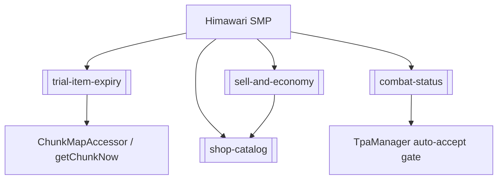

# Himawari SMP — Project Hub

Fabric Minecraft server mod (`com.survivalmod`, archives base `survivalmod`) for the HimawariSMP
server. Java 25, Minecraft 26.2, Fabric Loom. Source lives at
`\\wsl.localhost\Ubuntu\home\woopsy\Project\Minecraft Bot\Himawari\Himawari Mod\SMP`.

## Build & deploy
- Build from **WSL**: `./gradlew build` (Windows git can't touch the WSL-hosted repo; use WSL git too).
- `build.gradle` has a `deployToMods` task (finalizes `jar`) that deletes old `survivalmod-*.jar`
  and copies the fresh jar into `modsDir`.
- `modsDir` (in `gradle.properties`) = `/mnt/d/Minecraft Server/HimawariSMP_1/mods`
  (= `D:\Minecraft Server\HimawariSMP_1\mods`, the live server). So a successful build auto-deploys.
- Mixins registered in `src/main/resources/survivalmod.mixins.json`; remote config via Supabase
  `RemoteConfig.loadModConfig(...)`.

## Subsystems (nodes)
- [[trial-item-expiry]] — trial-enchant tools and their expiry/destruction.
- [[shop-catalog]] — survival buy/sell tabs (building/mobdrops/farms/resources/other) via Supabase
  `shop_catalog`.
- [[combat-status]] — PvP combat tag, draining boss bar, and the teleports it gates (RTP/home/TPA).
- [[sell-and-economy]] — `/sell` (held stack), `/sellall`, and `realSellPrice` gating.
- (auction, homes, spawners, potions, linking — add nodes as touched.)

## Dependency sketch

