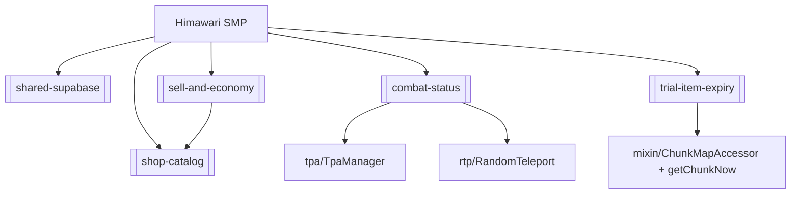

# Himawari SMP (Mod) — Architecture

Mod sub-hub of [[Himawari-System]]. Fabric Minecraft server mod (`com.survivalmod`, archives base
`survivalmod`). Java 25, Minecraft 26.2, Fabric Loom. Source:
`\\wsl.localhost\Ubuntu\home\woopsy\Project\Minecraft Bot\Himawari\Himawari Mod\SMP`.

## Build & deploy
- Build from **WSL**: `./gradlew build` (Windows git can't touch the WSL repo; use WSL git too).
- `build.gradle` `deployToMods` (finalizes `jar`) deletes old `survivalmod-*.jar` and copies the fresh
  jar into `modsDir` = `/mnt/d/Minecraft Server/HimawariSMP_1/mods` — a successful build auto-deploys.
  **Restart the server to load it.** Bump `mod_version` in `gradle.properties` per bundle (`/version`).
- Mixins in `src/main/resources/survivalmod.mixins.json`. All config/prices live in Supabase via
  `supabase/RemoteConfig` (see [[shared-supabase]]); empty/code-default fallback when unreachable.

## Entry point
`SurvivalMod.java` — `onInitialize`: builds every manager (static singletons, `SurvivalMod.shop()`,
`.economy()`, `.combat()`, …), registers the single `END_SERVER_TICK` pump (drives RTP, TPA, homes,
spawners, combat bar, trial expiry, price lore, sidebar, AFK, validator), the `AFTER_DAMAGE` combat
hook, and load/save lifecycle. Commands in `command/ModCommands.java` (Brigadier).

## Subsystem map (packages under `com/survivalmod/`)
**Economy & trade**
- `economy/` — `EconomyStore` (balances), `EconomyConfig`, `EconomyValidator` (craft-arbitrage guard).
- `shop/` — `ShopManager`, `ShopPrices`, `PriceLoreManager`, `Enchants`. → [[sell-and-economy]],
  [[shop-catalog]].
- `auction/` — `AuctionStore`/`Config`/`Listing` (player auction house, Supabase-backed).
- `order/` — `OrderStore`/`Order` (buy-order marketplace, Supabase-backed).
- `spawner/` — custom internal-loot spawners (`Manager`/`Config`/`Nbt`/`Items`/`Store`).
- `potion/` — `PotionItems` + `PotionBuffStore` (custom 24h Haste/Speed/Strength buffs).

**Movement & teleport**
- `rtp/` — `RandomTeleport` + `RtpConfig` (per-dimension safe random TP). → [[combat-status]].
- `tpa/` — `TpaManager` (/tpa, auto-accept, combat-gated). → [[combat-status]].
- `home/` — `HomeManager`/`HomeStore`; `warp/` — `WarpStore`.
- `combat/` — `CombatTracker` (PvP tag + boss bar; gates RTP/home/TPA). → [[combat-status]].

**Items & world**
- `trial/` — time-limited enchant tools + expiry destruction. → [[trial-item-expiry]].
- `item/` — `UnobtainableItems` (survival-obtainable filter, shared w/ anti-cheat).
- `effect/` — `NightVisionStore` (persistent night vision).

**Players & social**
- `rank/` — `Ranks`, `RankConfig`, `PermissionManager`, `TabListExtension` (ranks/perms/tab list).
- `stats/` — `StatsStore`/`PlayerStats` (kills/deaths/playtime). `player/` — `FirstJoinStore`.
- `prefs/` — `PlayerPrefs` (e.g. auto-accept TPA). `afk/` — `AfkManager`.
- `scoreboard/` — `Sidebar`, `HiddenLines`, `ScoreboardConfig`. `moderation/` — `MuteManager`.
- `link/` — `LinkManager` (in-game `/link`). `discord/` — `DiscordManager`/`Config` (mod→Discord).

**Infra**
- `supabase/` — `SupabaseClient` (REST), `RemoteConfig` (config seam), `SupabaseRealtime` (live WS),
  `SupabaseSettings`. → [[shared-supabase]].
- `config/` — `ModConfig`, `ConfigFiles`. `command/` — `ModCommands` (Brigadier registration).
- `gui/` — ~18 chest menus (Shop, Auction, Order*, Home, Spawner, Potion, BalTop, Help, Survival,
  Sign/Bedrock input forms).
- `mixin/` — `ChunkMapAccessor` (loaded chunks), `BaseSpawnerMixin`, `InventoryMixin`,
  `ConsumableMixin`, `AnvilMenuMixin`, `SignUpdateMixin`, `ServerPlayerTabListMixin`.
- `util/` — `ExperienceUtil`.

## Dependency sketch

## Related
[[Himawari-System]] · [[Himawari-Bot]] · [[shared-supabase]]
