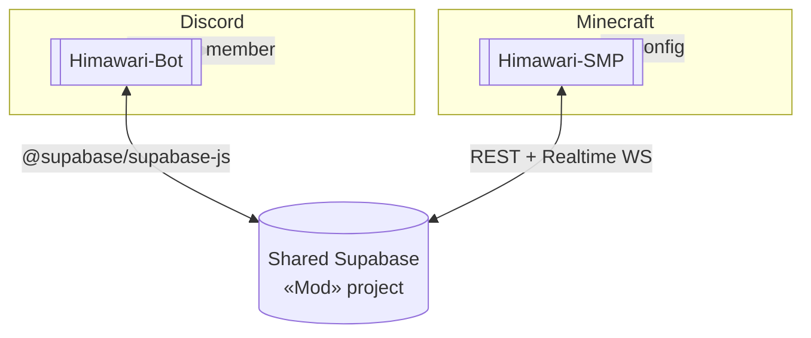

# Himawari — System Architecture

Top hub for the whole Himawari system for the **WopsSMP** Minecraft server. One git repo holds
**two projects that work together**, joined by **one shared Supabase database**.

```
Himawari/
├── Himawari Bot/   ← Discord bot (Node.js / discord.js 14)         → [[Himawari-Bot]]
├── Himawari Mod/   ← Fabric Minecraft mod (Java 25, source in SMP/) → [[Himawari-SMP]]
└── docs/           ← cross-cutting docs for BOTH sides
```

Source: `\\wsl.localhost\Ubuntu\home\woopsy\Project\Minecraft Bot\Himawari`.

## How the two sides fit together

- **[[shared-supabase]]** is the bridge: account linking (Discord ⇄ Minecraft), plus the mod's
  live config (shop, spawners, features, RTP, ranks) and backups (auction/order), and the bot's
  ticket/embed/link config.
- A schema change on one side affects the other — **coordinate schema changes across both projects.**

## Build / deploy (two pipelines)
- **Mod**: build from **WSL** `cd "Himawari Mod/SMP" && ./gradlew build`; `deployToMods` auto-copies
  the jar to `D:\Minecraft Server\HimawariSMP_1\mods` (server restart needed to load). Version in
  `gradle.properties` (`/version` reflects it). Currently `survivalmod-1.0.16.jar`.
- **Bot**: Node.js, deployed to **Discloud** (`discloud.config`); slash commands registered on boot
  via `utils/RegisterCommands.js`. Config in `Himawari Bot/config.json`.

## Docs (in-repo, keep in sync with code)
`docs/project-structure.md`, `linking.md`, `configuration.md`, `setup-supabase.md`, `commands.md`,
`tickets.md`, `embeds.md`, `deploy-discloud.md`; mod internals in `Himawari Mod/SMP/docs/`.

## Sub-hubs & nodes
- [[Himawari-Bot]] — Discord side.
- [[Himawari-SMP]] — Minecraft mod side (subsystem map).
- [[shared-supabase]] — the shared DB, table catalog, and linking flow.
- Mod feature nodes: [[shop-catalog]] · [[combat-status]] · [[sell-and-economy]] · [[trial-item-expiry]]
