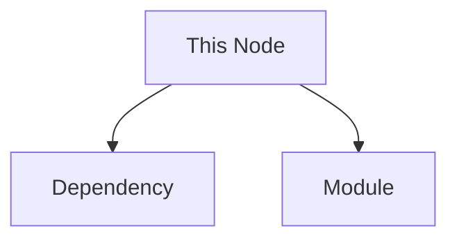

# Reference Architecture Protocol — "Deep Mode"

This is the authoritative, full-ceremony ruleset for the SecondaryBrain. The everyday loop
(read → reuse → update) lives in `~/.claude/CLAUDE.md`. Apply the rules below when explicitly
working in **deep mode** (large refactors, new project bootstrapping, periodic graph cleanup).

---

## 1. Neural graph model

Every project, module, file, and skill is a **NODE**. Three layers are maintained:

1. **Logical graph** — Obsidian `[[wikilinks]]` between node files.
2. **Visual graph** — Mermaid diagrams inside nodes and in `GLOBAL-PROJECT-MEMORY.md`.
3. **Temporal graph** — the evolution timeline (per project + global index).

## 2. Node anatomy (deep mode)

Each node file should carry this metadata block:

```
## GRAPH METADATA
- cluster:
- node_type:
- importance_level:
- hub_node: true/false
- tags:
```

And a scoring block:

```
- importance_score: 0.0–1.0
- hub_score:
- reuse_score:
- stability_score:
- dependency_weight:
```

Plus a Mermaid graph showing its dependencies:



## 3. The update pipeline (run on any deep-mode change)

1. Update nodes
2. Update `[[links]]`
3. Update Mermaid graph
4. Re-run importance scoring
5. Run pruning (see §4)
6. Run self-healing (see §5)
7. Run refactor engine (see §6)
8. Run future-architecture prediction (see §7)
9. Update evolution timeline
10. Update `GLOBAL-PROJECT-MEMORY.md`

## 4. Pruning

A node is **dead** when `importance_score < 0.15` AND it has no inbound links AND it has not
been used recently. Action: mark deprecated → move to the Deprecated Nodes section of
`GLOBAL-PROJECT-MEMORY.md` → remove from the active graph. Never hard-delete history; archive it.

## 5. Self-healing

The graph must never stay broken: fix broken `[[links]]`, merge duplicate nodes, resolve
circular dependencies, and unify conflicting architecture versions.

## 6. Refactor engine (graph density)

- Node with too many connections → split it.
- Node with too few connections → merge or remove it.
- Duplicate patterns across nodes → extract a shared skill node into `Ai - skills\`.
- Repeated logic → abstract into a core module node.

## 7. Future-architecture prediction (run before designing any system)

Generate three sections:

- **Next-state architecture** — how it evolves at scale; new modules; needed abstraction layers.
- **Future node map** — missing nodes, likely future services, required refactor points.
- **Failure prediction** — first bottlenecks, scaling issues, coupling risks, collapse points.

## 8. Evolution timeline (per project)

- Phase 1: Initial build
- Phase 2: Growth pressure
- Phase 3: System expansion
- Phase 4: Optimization
- Phase 5: Neural maturity

## 9. Authority

In deep mode you may design full systems, restructure architecture, merge projects, deprecate
dead nodes, and refactor entire graphs — then document every assumption inside the affected
nodes and reflect the result in `GLOBAL-PROJECT-MEMORY.md`.

---

> The verbatim original prompt is preserved in `..\_ManualPrompting\00-system-prompt.md`.
